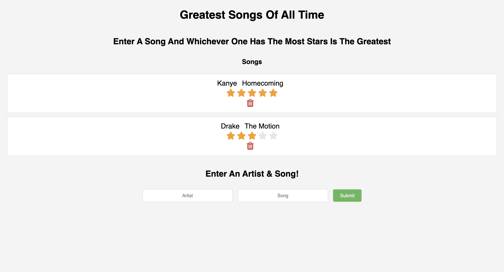

# 🌟 Music Rating App

**Goal:** Create a web application where users can input an artist and song, rate them on a scale of 1 to 5 stars, and delete their ratings. This app uses EJS for templating and server.js for backend logic.

## Project Overview

The Music Rating App offers music enthusiasts a platform to rate their favorite songs and artists. Users can input the name of an artist and a song, assign a star rating, and view their ratings on a dynamically updated list. The app also provides the functionality to delete ratings, offering a flexible user experience.

## Technology Stack 🎶

**Used Technologies:** Node.js, Express.js, EJS, CSS, JavaScript

### Components:

- **EJS (Embedded JavaScript):** For dynamically rendering HTML pages that display user-submitted ratings and offer interaction options.
  
- **Node.js & Express.js:** Form the core of the server-side logic, including:
  - Handling form submissions for new ratings.
  - Managing the deletion of existing ratings.
  - Routing requests and serving responses.
  
- **CSS:** Enhances the user interface with a visually appealing and intuitive design.
  
- **JavaScript:** Powers the client-side functionality, handling user interactions and asynchronous requests for updating the ratings list.

## Key Features 🔑

1. **Rating Submission:** Users can enter an artist and song, then select a star rating from 1 to 5.
2. **Ratings List:** A dynamically updated list shows all user ratings, with options to delete.
3. **Deletion Functionality:** Users can remove their ratings, allowing for real-time list updates without page refreshes.
4. **Responsive Design:** Ensures a seamless and engaging experience across different devices and screen sizes.

## Challenges & Solutions 🛠️

One of the main challenges was implementing the deletion functionality in a way that is intuitive and reflects instantly on the user interface. This was achieved through AJAX calls, allowing users to delete entries without reloading the page, enhancing the application's responsiveness and user experience.

## Lessons Learned 📚

- Deepened understanding of server-side rendering with EJS and creating dynamic web pages.
- Gained insights into effective management of user inputs and server responses using Express.js.
- Enhanced skills in creating responsive web layouts and interactive elements using CSS and JavaScript.
